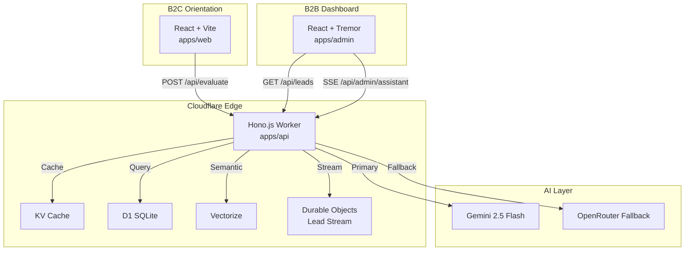

# JAD2 TAWJIH — Elite AI Student Recruitment Engine for Morocco

> **Orientation supérieure intelligente pour les bacheliers marocains**

## Architecture



## Tech Stack

| Layer | Technology |
|-------|-----------|
| Runtime | Cloudflare Workers (Hono.js v4+) |
| Database | Cloudflare D1 (SQLite) via Drizzle ORM |
| Cache | Cloudflare KV |
| Vector DB | Cloudflare Vectorize |
| Real-time | Cloudflare Durable Objects |
| B2C Frontend | React 18 + Vite 5 + Tailwind CSS 3.4 |
| B2B Frontend | React 18 + Vite 5 + Tremor React + TanStack Table |
| AI | Gemini 2.5 Flash → OpenRouter Llama 3 fallback |
| Auth | Cloudflare Access (JWT) + RBAC |
| i18n | French (primary), Arabic RTL, English |

## Project Structure

```
tawjih-ai/
├── apps/
│   ├── web/          # B2C Orientation App
│   ├── admin/        # B2B Dean Dashboard
│   └── api/          # Hono.js Cloudflare Worker
├── packages/
│   ├── shared/       # Zod schemas, Drizzle ORM, types
│   ├── ui/           # Shared shadcn/ui components
│   └── ai/           # AI prompts, routing, parsers
├── tooling/
│   ├── wrangler/     # Wrangler configs per env
│   └── drizzle/      # Migrations + seed data
└── .github/workflows/
    └── deploy.yml    # CI/CD pipeline
```

## Quick Start

### Prerequisites

- Node.js 20+
- npm 10+
- Cloudflare account with Workers, D1, KV, Vectorize

### 1. Install dependencies

```bash
npm install
```

### 2. Configure secrets

```bash
cd tooling/wrangler
npx wrangler secret put GEMINI_API_KEY
npx wrangler secret put OPENROUTER_API_KEY
npx wrangler secret put IP_PEPPER
npx wrangler secret put TURNSTILE_SECRET_KEY
npx wrangler secret put CLOUDFLARE_ACCESS_TEAM_DOMAIN
```

### 3. Initialize database

```bash
# Create local D1 and run migrations
npx wrangler d1 create tawjih-db
npx wrangler d1 migrations apply tawjih-db --local

# Seed universities
npm run db:seed
```

### 4. Run locally

```bash
# API Worker
npm run dev:api

# B2C Web (port 5173)
npm run dev:web

# B2B Admin (port 5174)
npm run dev:admin
```

### 5. Run tests

```bash
npm test
```

## Database Schema

### Students (CNDP Anonymized)

| Field | Type | Notes |
|-------|------|-------|
| `uuid` | TEXT | Public anonymized ID |
| `bacTrack` | TEXT | SM, PC, SVT, SE, SH, STI, L |
| `generalGrade` | REAL | 0-20 |
| `mention` | TEXT | Passable → Très Bien |
| `cndpAnonymizedSummary` | TEXT | Max 180 chars, no PII |
| `retentionExpiry` | INTEGER | Auto-delete after 24 months |

### Universities (B2B Clients)

| Field | Type | Notes |
|-------|------|-------|
| `slug` | TEXT | Unique identifier |
| `tier` | TEXT | premium, selective, standard, accessible |
| `requiredSeuil` | REAL | Minimum general grade |
| `optInCost` | INTEGER | MAD to unlock lead |
| `monthlyQuota` | INTEGER | Lead cap |

### Leads (Matching Bridge)

| Field | Type | Notes |
|-------|------|-------|
| `studentUuid` | TEXT | References students.uuid (privacy) |
| `matchProbability` | REAL | 0.0-1.0 |
| `matchType` | TEXT | rule_based, semantic, hybrid |
| `hasOptedIn` | INTEGER | Boolean |
| `status` | TEXT | new, contacted, converted, dormant |

### Audit Logs (CNDP Mandatory)

| Field | Type | Notes |
|-------|------|-------|
| `actorType` | TEXT | student, dean, system, ai |
| `action` | TEXT | VIEW_PII, OPT_IN, AI_EVALUATE |
| `ipHash` | TEXT | SHA256 with pepper |
| `metadata` | TEXT | JSON audit context |

## AI Router Logic

```
1. Check KV cache (SHA256 prompt hash) → TTL 2h
2. Primary: Gemini 2.5 Flash (8s timeout)
3. Fallback: OpenRouter Llama 3 (15s timeout)
4. On double failure: Return generic fallback JSON
5. Log all attempts to ai_logs (latency, tokens, status)
```

## CNDP Compliance

- ✅ All PII encrypted in transit (Cloudflare HTTPS)
- ✅ IP addresses hashed with pepper (SHA256)
- ✅ Audit logs immutable (D1 append-only pattern)
- ✅ 24-month retention with automatic expiry
- ✅ Opt-in gating before any PII disclosure
- ✅ `x-cndp-audit-id` header on every response

## Mobile-First Design

- Thumb-reachable CTAs at bottom
- Native input modes (`inputmode="decimal"`, `type="tel"`)
- Bottom sheets for filters
- Touch targets minimum 44px
- PWA with offline form auto-save to localStorage

## Deployment

```bash
# Deploy API Worker
npm run deploy -w apps/api

# Deploy Web (Cloudflare Pages)
npx wrangler pages deploy apps/web/dist --project-name=tawjih-web

# Deploy Admin (Cloudflare Pages)
npx wrangler pages deploy apps/admin/dist --project-name=tawjih-admin

# Run D1 migrations
npx wrangler d1 migrations apply tawjih-db --env production
```

## Environment Variables

| Variable | Required | Description |
|----------|----------|-------------|
| `GEMINI_API_KEY` | Yes | Google AI API key |
| `OPENROUTER_API_KEY` | Yes | OpenRouter API key |
| `CLOUDFLARE_ACCESS_TEAM_DOMAIN` | Yes | JWT validation |
| `IP_PEPPER` | Yes | CNDP IP hashing |
| `TURNSTILE_SECRET_KEY` | Yes | Bot protection |
| `ENVIRONMENT` | No | development / production |

## License

Proprietary — JAD2 TAWJIH SARL. All rights reserved.
